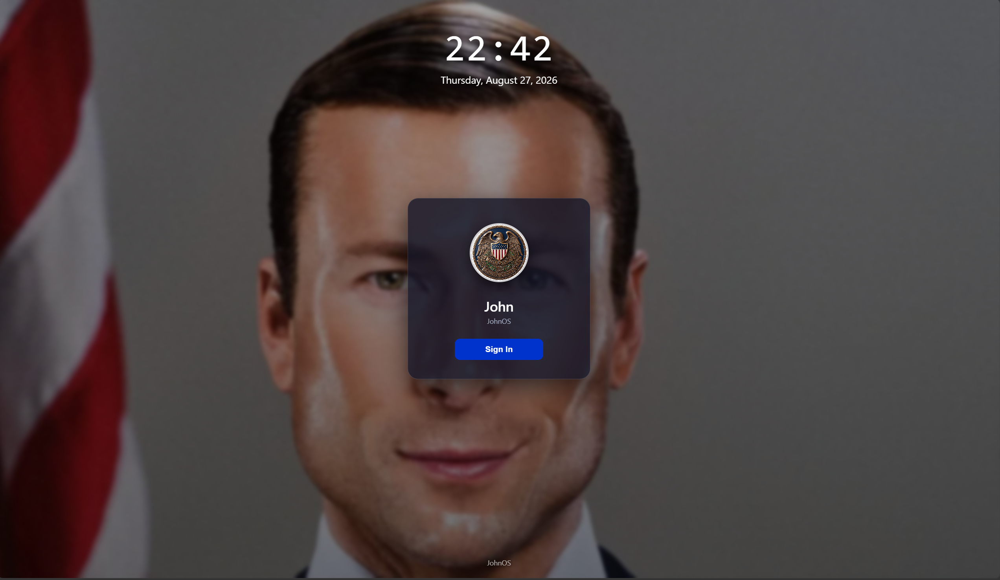

# President JohnOS

A meme presidential-themed web operating system.

## About

President JohnOS is a browser based Operating System built with HTML, CSS, JAVA SCRIPT
and this operating systems has built in security system and many more apps!

**[Demo ](https://president-john-os.vercel.app/)**

## Features 

*  Freedomculator 
*  Freedomotes 
*  FreedomSound

## New Features

* Lock Screen for security purpose
* New Wallpaper
* Freedom Magzine
* Freedom Browser

## Upcoming Features
* Freedom Call dailer
* National Reserver App
* Nuke Button
---

## Built using

* **HTML5** 
* **CSS3** 
* **JavaScript** 
* **Vercel** 

---

## Credits

Created by **ME and only me**

* GitHub: **[@Arhan-fx](https://github.com/Arhan-fx)**
* Repository: **[President-John-OS](https://github.com/Arhan-fx/President-John-OS)**

