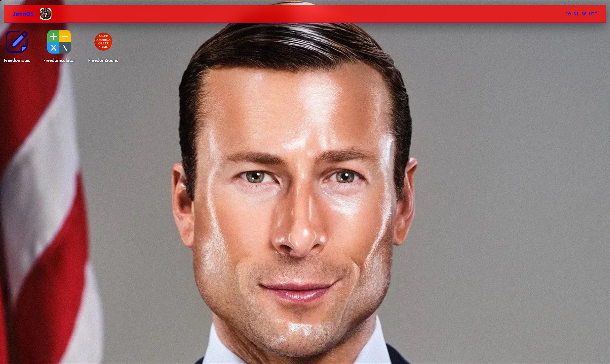

# JohnOS

A meme presidential-themed web operating system.



## Quick Start

**[Launch President John OS](https://president-john-os.vercel.app/)**

Please consider to give a star to this repo

### Run locally if you want little inconvenience 

```bash
git clone https://github.com/Arhan-fx/President-John-OS.git
cd President-John-OS
```

Then open `index.html` in your browser.

For the best experience, run it through a local HTTP server

```bash
python -m http.server 8000
```

Then visit:

```text
http://localhost:8000
```

---

## Features 

*  This is among the most flagship OS you can find in the market
*  This thing is only made for government work
*  This thing comes with an app that apple did not dared to introduce in ipads till IOS26 update which is the **CALCULATOR
*  This OS also has a great feature to write down your freedom methods in freedomotes
*  One of the most flagship thing this OS has to offer is FreedomSound, so you keep feeling patriotic while doing your work

---


## 🛠️ Built With

* **HTML5** used for application structure (Just like a body for a plane)
* **CSS3** used for visual design (Same as adding camouflage to a F-22 )
* **JavaScript** used for OS functionality (Oil from every other nation)
* **Vercel** used for Deployment (A patriotic pilot who spread freedom)

---


---

## Credits

Created by **ME and John Politican**


* GitHub: **[@Arhan-fx](https://github.com/Arhan-fx)**
* Repository: **[President-John-OS](https://github.com/Arhan-fx/President-John-OS)**


